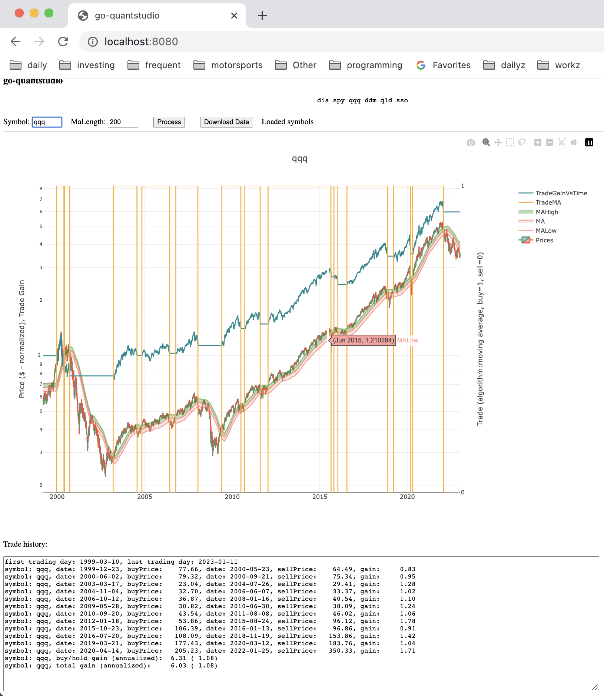

# go-quantstudio
go-quantstudio is a GO (GOLANG) application for quantitative analysis using GO. There are three primary pieces of go-quantstudio: the downloader, the quantitative analysis features, and the automator.

## Downloader highlights:
* Downloads security price data from Yahoo.
* Can be used strictly to download data and save as CSV format for use in other applications.
  * Data will always be returned in Date ascending order.
* Can be used as a package to download data, or use previously downloaded data, for use programmatically. See ExampleNewGroup() in ./downloader/financeYahoo/downloader_test.go for how to load data from a file into a Group object for programmatic use.

## Quantitative analysis highlights:
* After the download, or loading previously downloaded data, an http server is used so you can browse the results graphically.
  * Supports zoom, hover tips, etc. 

## Automator highlights
* Includes a GUI automator that allows automated calls to the go-quantstudio REST API from a headless browser. The automator then saves the charts from the browser as image files. (This is the only way to get rendered output, as the rendering is done at the client.) Keep this application running all the time, and have the output directory synced to Google Drive. That way you always have access to the latest trade output and charts, from any device.

```
% go build && ./go-quantstudio --help
Usage of ./go-quantstudio:
  -groupname string
    	Name for this group of symbols. Used for naming output files when processing groups of symbols. I.E. maybe you want to download/analyze stocks separately from ETFs (default "ETFs")
  -livedata
    	Get live data; otherwise load from file created during prior call. (Using the download button in the GUI will ALWAYS download new data.) (default true)
  -logfile string
    	Name of log file in /Users/pauldunn/tmp/go-quantstudio; blank to print logs to terminal.
  -loglevel int
    	Logging level; default 1. Zero based index into: [debug info warning audit error] (default 1)
  -runrange
    	When true, runs a range of parameters and exits.
  -symbolCSVList string
    	Comma separated list of symbols for which to download prices (default "dia,spy,qqq,ddm,qld,sso")
```

## Suggested use to run the GUI
In one terminal:
```
go build && ./go-quantstudio
```
Then open a browser to http://localhost:8080

## Suggested use to save the quant output
If you would like to save the output data, maybe with it synced to something like Google drive for viewing while away from your computer, use the following to have logs saved to a file instead of printed to the terminal.
```
go build && ./go-quantstudio -logfile=log.txt
```

Or, if you'd like the output logged to file AND dumped to the terminal:
```
go build && ./go-quantstudio -logfile=log.txt | tail -f $HOME/tmp/go-quantstudio/log.txt.0
```

## Suggested use if you'd like daily automatic updates for the output
Sync the output folder to Google Drive, or another similar service, and always have the latest data ready for your viewing, on any device.

In a **second** terminal (go-quantstudio must be running as shown above):
```
cd automator; go build && ./automator
```
## Example GUI

